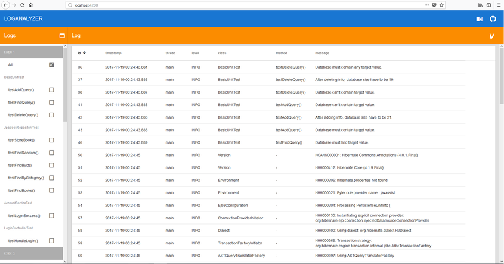
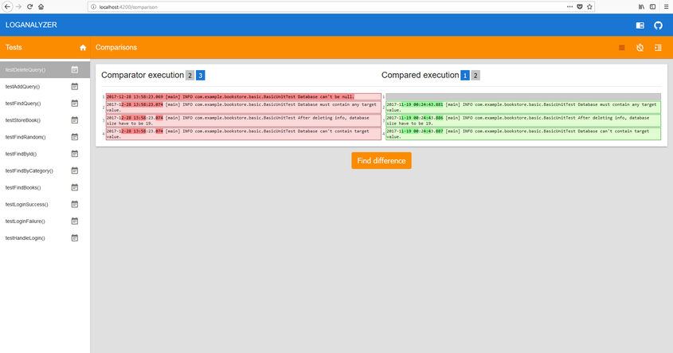
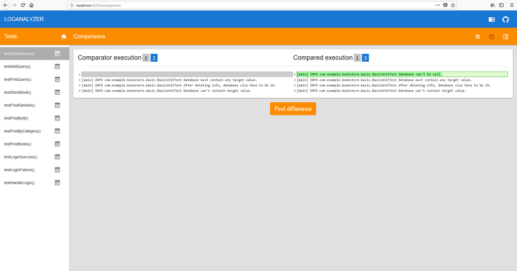
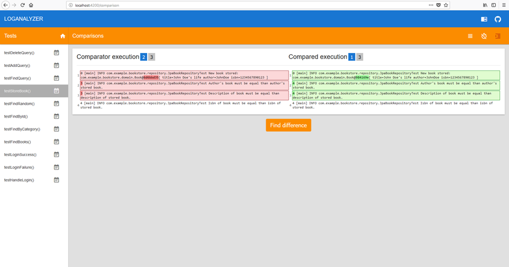

 

# TestLogAnalyzer - Log analysis module for ElasTest.

## Getting started
1. Clone this repository.
2. Open your comand prompt and navigate to the root project.
3. Execute `docker-compose up` and navigate to **http://localhost:4200** on your favourite browser.
4. Enjoy!

## TestLogAnalyzer
TestLogAnalyzer allows you to work with determinate kinds of logs. In this moment, `Beta version`, TestLogAnalyzer works with Logback logs.

### Data format allowed
#### Logback format
LOGANALYZER works with the following format `%d{yyyy-MM-dd hh:mm:ss.SSS} [%t] %5-level %logger{36} %m%n`. In the table below, you can see, in case that you don't know, what each component means:

Component | What does it mean?
:--------: | -------------
%d | Timestamp following the format yyyy-MM-dd HH:mm:ss.SSS.
[%t] | Thread identifier between square brackets.
%-5level | Level of logging event.
%logger{36} | Name of the logger at the origin of the logging event (name class and package).
%m%n | Log message.

### Content of pages
#### Home
In this page, you can select a test of an execution (or see the whole execution) and it will be displayed. In addition to the above mentioned, you can filtering the displayed results by Maven messages or not.

#### Comparison
In this page, you can select a test and compare executions of it.
##### Normal comparison

##### Comparison with no timestamp

##### Comparison with time-diff estimation.

## Getting started with Spring Logs Generator
Ensure `JAVA_HOME` environment variable is se and points to your JDK installation directory. Follow these steps:
1. Go to Apache Maven Project [download](https://maven.apache.org/download.cgi) page and download the Binary tar.gz archive.
2. Extract it to the directory you wish to install Maven. The best way to do it is inside Program Files directory.
3. Set the environment variables: `M2_HOME=C:\Program Files\apache-maven-version`, `M2=%M2_HOME%\bin`.
4. Append the string `%M2` to the end of the system variable *Path*.
5. Open Command Console and type `mvn --version`.
6. Go to Spring Logs Generator project in [Github](https://github.com/cvazquezlos/LOGANALYZER-SpringLogsGenerator) and clone or download it.
7. Open the Command Console and navigate inside project. Then, execute `mvn clean install --log-file log.txt` to save all the information about the test.

## Getting started with Elasticsearch Data Updater
Ensure you have Elasticsearch installed and an instance of it running.
1. Go to Elasticsearch Data Updater project in [Github](https://github.com/cvazquezlos/LOGANALYZER-ElasticsearchDataUpdater) and clone or download it.
2. Make sure that your Elasticsearch version is the same than POM ES version.
3. Create (you can use Kibana) an index called "loganalyzer" (don't required timestamp field).
4. Run it.

## Bibliography
1. https://ag-grid.com/javascript-grid-properties - Grid properties.
2. https://qbox.io/blog/parsing-logs-using-logstash - Parsing logs using Logstash.
3. https://elastic.co/guide/index.html - Getting started guide, API, Pagination and Kibana requests (filtering, ranges, POST and GET requests).
4. http://jupyter.org/ - Getting started guide, kernels and design.
5. https://developer.mozilla.org/es/ - Date type in TypeScript language and CORS disable for Elasticsearch requests, HTMLElement API, RegExp.
6. https://typescriptlang.org/docs/home.html - Looking for TS simple and complex types.
7. http://getbootstrap.com/css/ - Bootstrap CSS and components guidelines.
8. https://teradata.github.io/covalent - Teradata Covalent library.
9. https://github.com/elastest/elastest-torm/tree/master/elastest-torm-gui/src/app/elastest-log-manager - Example of Covalent usage.
10. https://github.com/Teradata/covalent-quickstart - Teradata Covalent quickstart.
11. https://material.angular.io/ - Angular 2 Material Design guidelines.
12. http://codingpedia.org/ - Logging with SLF4J and Logback.
13. https://dzone.com/ - JUnit, Logback, Maven with Spring.
14. https://logback.qos.ch - Logback manual and format guidelines.
15. https://docs.spring.io/ - Spring Boot features (logging), Spring Data.
16. https://www.mkyong.com/ - Sping Boot, Spring Data and Elasticsearch.
17. http://books.sonatype.com - Maven CMD options.
18. https://beginnersbook.com/ - String to Date, Date to String Java 8 documentation.
19. http://codemirror.net/ - Requirements.
20. http://citeseerx.ist.psu.edu/viewdoc/summary?doi=10.1.1.4.6927 - An O(ND) Difference Algorithm and Its Variations (1986).
21. https://github.com/GerHobbelt/google-diff-match-patch - Google Diff Match Patch: Universal Algorithm.
22. https://code.google.com/archive/p/google-diff-match-patch/ - Google Diff Match Patch by Neil Fraser.
23. https://scotch.io/ - Dockerize Angular 4 app.
24. https://docs.docker.com/ - Dockerizing apps, update tags and images to Docker Hub, Docker Compose.
25. https://dpopescu.me/ - Dockerfile content in Angular 4 app.
26. https://github.com/taskrabbit/elasticsearch-dump - ElasticDump (moving and saving indices).
27. https://khanhicetea.com/ - Backup, add and restore Elasticsearch with Docker.
28. https://elk-docker.readthedocs.io/ - Dockerized ELK Stack.
29. https://jaxenter.com/ - Sharing Docker volumes across the Internet.
30. https://martinfowler.com/ - Refactoring with loops and collection pipelines.
31. https://forum.freecodecamp.org/ - NPM behind a proxy server.
32. https://www.quora.com/ - Reducing code complexity.
33. https://www.jhipster.tech/ - Configuring a corporate proxy.
34. https://auth0.com/blog/whats-new-in-angular5/ - Angular 5 updated.
35. https://docs.travis-ci.com/ - Pull requests and security restrictiosn.
36. http://blog.ninja-squad.com/ - Migrating Http module from Angular 4 to Angular 5.
37. https://codecraft.tv/ - HTTP with Observables in Angular 5.
38. https://angular.io/ - Angular 4 and 5 API.
39. https://github.com/bill-long/angular-rich-text-diff - Google Diff-Match-Patch.
40. https://www.w3schools.com/angular/ - AngularJS modules.

## Involved technologies
Element           | TestLogAnalyzer needs it because...                    | Official site
------------------|----------------------------------------------------|-----------------------------
Angular 5         | App development framework                          | https://angular.io/
Angular Material  | Material Design components for Angular             | https://material.angular.io/
Angular-CLI       | Command line interface for Angular                 | https://cli.angular.io/
CircleCI          | Continuous Integration and Delivery                | https://circleci.com/
CODEBEAT          | Automated code review for the browser              | https://codebeat.co
CodeMirror        | Text editor for the browser                        | https://codemirror.net/
Code Climate      | Code quality test                                  | https://codeclimate.com/
Docker            | Project packaging and virtualization               | https://www.docker.com/
Docker Compose    | Tool for running multi-container Docker apps       | https://docs.docker.com/compose/
Elasticsearch     | Search, indexing and analytics data engine         | https://www.elastic.co/products/elasticsearch
Github            | Software development platform                      | https://github.com/
Java              | Programming language (ES client and log generator) | https://www.java.com
Kibana            | ES Data visualization and ES Stack navigation      | https://www.elastic.co/products/kibana
Maven             | Software project management and comprehension tool | https://maven.apache.org/
Node.js           | JavaScript run-time Environment                    | https://nodejs.org/es/
NPM               | Package manager for JavaScript                     | https://www.npmjs.com/
Postman           | API Development Environment                        | https://www.getpostman.com/
Spring            | Application development Framework                  | https://spring.io/
Spring Tool Suite | Eclipse-based development environment              | https://spring.io/tools
Teradata Covalent | Teradata UI Platform for Angular                   | https://teradata.github.io/covalent/
Travis CI         | Code testing and deploying tool                    | https://travis-ci.org/
TypeScript        | Programming language (Angular app)                 | https://www.typescriptlang.org/
Webstorm          | JavaScript IDE                                     | https://www.jetbrains.com/webstorm/
